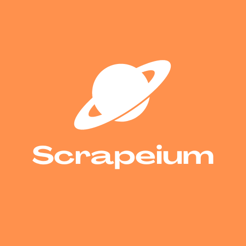

# Scrapeium 
A poweful query language for scraping the web.

## What is Scrapeium?

- Scrapeium is a simple, flexible, portable, declarative query language for dynamically scraping web pages (inspired by GraphQL SQL, and JavaScript)
- Gone of the days of writing long code to scrape small data from websites
- Scrapeium has the goal of making scraping the web much simpler, so you feel that you are “querying” a website
- Fundamentally, Scrapeium prioritizes simplicty and freedom above everything else
- Gives you the ability to scrape large amounts of data with much fewer lines of code and no setup
- Support multiple backends
- Can be implemented in any language

## Scrapeium Principles

- **Powerful but simple** → it is tempting to add a lot of features and stuff to the language, but it is to remain as lean and simple to use. At the same time, it has to be flexible to meet almost any scraping requirement
- **It is NOT a programming language** → this language is strictly for querying and nothing else. Even though it have some functionality like loops, variables and expressions, the language is purposely limited so it can do one thing well: query the web
- **Must remain portable and flexible** → one of the main goals of the project is to be able to query websites from almost everywhere with the right back end and integration
- **Must remain flexible**→ the user should be able to get EXACTLY what they want (and potentially more) from every query they write or execute
- **The goal isn’t speed** → technically it is and isn’t. The goal isn’t to to be able to scrape data at light speed, but goal is to be able to write queries at light speed. We want to prioritize the development process. There is a reason why Python is as popular and powerful as it is.
- **Comfort over speed**
- **Syntax you can “speak” out loud**
- **Completely Unopinionated** → we leave it to you to decide to query the web the way you want to (but like any language, there are obviously some recommended best practices)

To see how the language works, go [here](DESIGN.md).
